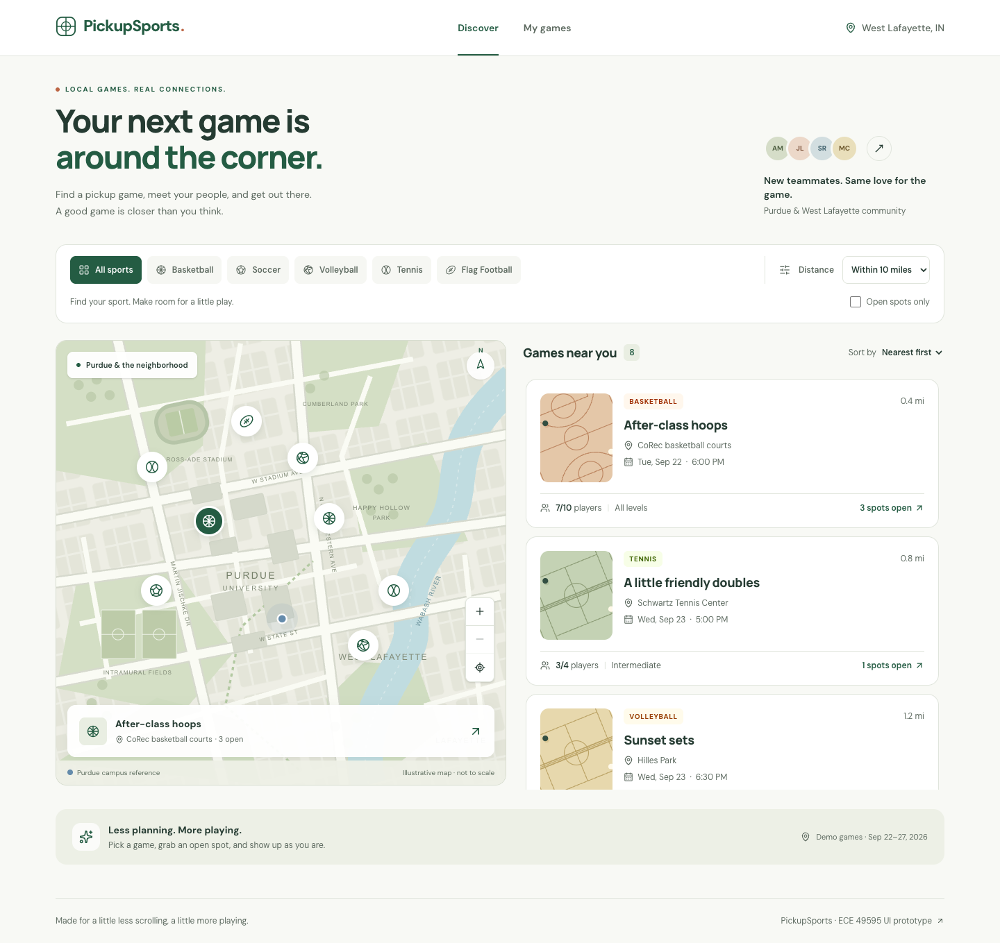

# ECE 49595 Exercise 3 – UI Skill

**PickupSports** is a responsive pickup sports discovery prototype for the Purdue / West Lafayette community. Find a game, explore its details, and try joining an open spot.

## Demo Video

A new PickupSports recording is required before video submission. Follow the [recording sequence](docs/video/README.md). The previous recording has been withdrawn because its UI branding is outdated.

## Technical Skill

Responsive, component-based React UI development using Next.js and Tailwind CSS.

## Project Relevance

Our semester project is a geolocation-based application for discovering nearby pickup sports games. My responsibility is the UI/frontend. This prototype develops the component design, React state, navigation, and responsive layout skills that will be directly used in that application. The typed mock data can later be replaced with backend results, and the illustrative map can be replaced with a real mapping service.

## What I Built

- **Discover page** with eight fictional Purdue / West Lafayette games across five sports.
- **Map UI** with original vector artwork, selectable game markers, a game preview, zoom, and reset controls.
- **Game cards** with sport, location, distance, date, time, skill level, and player capacity.
- **Sport filtering** for basketball, soccer, volleyball, tennis, and flag football.
- **Distance filtering** for 1, 2, 5, and 10 miles, combined with the sport selection.
- **Game details screen** at `/games/[id]`, with date, time, location, host, equipment notes, and a join button.
- **Responsive layout**: filters above a map/list split on desktop; map, filters, and a full game list stacked on mobile.
- **Reusable React components**, including `Navbar`, `GameCard`, `FilterBar`, and `MapPanel`.
- Open-spots filtering, distance/date sorting, empty states, a custom 404, keyboard focus styles, and a skip link.
- Capacity-aware demo join/leave actions and a **My games** view. Player totals update across views.



## Learning Objectives

1. Build an interface using at least four reusable React components.
2. Implement at least two interactive UI behaviors using React state.
3. Implement navigation between at least two application views.
4. Create a layout that works at both desktop and mobile screen sizes.

| Objective           | Implementation evidence                                                                               |
| ------------------- | ----------------------------------------------------------------------------------------------------- |
| Reusable components | `src/components/navbar.tsx`, `game-card.tsx`, `filter-bar.tsx`, `map-panel.tsx`                       |
| Interactive state   | Sport/distance/open-spots filters in `GameProvider`; selection/zoom in `MapPanel`; join/leave actions |
| Navigation          | Next.js links between `/`, `/games/[id]`, and `/my-games`, plus Back to Discover                      |
| Responsive layout   | Tailwind `sm:`, `lg:`, and `xl:` utilities; mobile map-first ordering; desktop side-by-side columns   |

## Running the Project

Use **Node.js 22.13 or newer** (Node.js 24 LTS recommended) and npm.

```bash
cd ece49595-exercise3-ui
npm install
npm run dev
```

Open [http://localhost:3000](http://localhost:3000).

For a fresh clone:

```bash
git clone https://github.com/PranavBalaji122/ece49595-exercise3-ui.git
cd ece49595-exercise3-ui
npm ci
npm run dev
```

For the optimized production version:

```bash
npm run build
npm start
```

There are no required environment variables, accounts, API keys, or backend services. Fonts are installed locally with Fontsource, so loading or building the interface does not request Google Fonts.

## Project Structure

```text
src/
├── app/
│   ├── page.tsx                 # Discover route
│   ├── layout.tsx               # Shared provider, navigation, and footer
│   ├── globals.css              # Tailwind theme, fonts, focus styles
│   ├── icon.svg                 # Original PickupSports mark
│   ├── not-found.tsx            # Unknown game / route fallback
│   ├── games/[id]/page.tsx       # Typed dynamic game route
│   └── my-games/page.tsx        # Joined games route
├── components/
│   ├── navbar.tsx               # Navbar, Brand, Footer
│   ├── game-card.tsx            # Reusable game summary
│   ├── filter-bar.tsx           # Controlled filter inputs
│   ├── map-panel.tsx            # Map selection, preview, zoom
│   ├── map-art.tsx              # Original schematic neighborhood map
│   ├── court-art.tsx            # Reusable vector court illustrations
│   ├── sport-icon.tsx           # Original sport symbols
│   ├── discover-explorer.tsx    # Filtering, sorting, responsive composition
│   ├── game-details.tsx        # Details and capacity-aware RSVP
│   ├── game-provider.tsx        # Shared filters and joined game state
│   └── my-games.tsx             # Joined games and empty state
└── lib/
    └── games.ts                 # Game/Sport types, mock fixtures, formatters
tests/discovery.spec.ts          # Browser behavior and accessibility tests
playwright.config.ts            # Desktop/mobile test projects
docs/
├── evidence.md                 # Screenshot instructions and paste-ready captions
├── verification.md             # Commands and actual verification results
└── screenshots/                # Captured desktop, filter, detail, mobile views
```

## How the UI Works

`GameProvider` uses React state to hold filters and joined game IDs above the route content. This preserves those values during Next.js client navigation, including Back to Discover. State intentionally resets on a browser refresh; there is no account or persistent storage.

`DiscoverExplorer` derives one filtered and sorted array from the typed fixtures and passes the same array to the game list and map. Combining filters therefore uses AND behavior: Basketball + 2 miles shows only basketball within 2 miles. Nothing matches? The empty state offers a reset action.

The details route resolves its ID on the server and passes a serializable game object to the interactive details component. `generateStaticParams` prebuilds all eight game pages. Unknown IDs use `notFound()`. The provider checks capacity before adding a player, and the details button disables joining a full game. Leaving restores the original count.

## Verification

```bash
npm run lint
npm run typecheck
npm run build
npm run test:e2e
```

The browser tests use an installed **Google Chrome** with an isolated test profile. They do not use your normal browser profile. `npm run test:e2e` starts the production server on port 3100, so run `npm run build` first. The suite covers desktop (1440 × 1000) and phone (390 × 664 CSS pixels), and also checks overflow at 320 pixels. Screenshot tests refresh the four PNGs in `docs/screenshots/`.

To use a running dev server instead:

```bash
PLAYWRIGHT_BASE_URL=http://127.0.0.1:3000 npm run test:e2e
```

If Chrome is unavailable, install it, or change the `channel: "chrome"` entries in `playwright.config.ts` to use Playwright's bundled Chromium and run `npx playwright install chromium`.

See [verification results](docs/verification.md) and the [screenshot evidence guide](docs/evidence.md).

## Prototype Boundaries

All games, rosters, hosts, and scheduled activities are fictional fixtures dated September 22–27, 2026. They are not live listings. Distances are illustrative miles from a fixed Purdue campus reference; no device location is requested. The original SVG map is schematic, not to scale, and not a navigation aid. Venue access, availability, and actual sporting facilities are not verified by this prototype.

Joining changes only local React state. It does not reserve a venue, contact anyone, or save data to a server. Authentication, live geolocation, map tiles, hosting, and backend integration are future semester-project work.

## New Work for Exercise 3

This project was created from scratch specifically for ECE 49595 Exercise 3. All UI implementation in this repository is new work for the assignment. The project began with the current official `create-next-app` starter; its default page and branding were replaced with this custom prototype.

## Implementation References

- [Next.js installation](https://nextjs.org/docs/app/getting-started/installation)
- [Next.js layouts and pages](https://nextjs.org/docs/app/getting-started/layouts-and-pages)
- [React: sharing state between components](https://react.dev/learn/sharing-state-between-components)
- [Tailwind responsive design](https://tailwindcss.com/docs/responsive-design)

Framework code, Lucide icons, and Fontsource fonts retain their upstream licenses. The map, court illustrations, sport symbols, and PickupSports mark are original SVG code created for this prototype.
